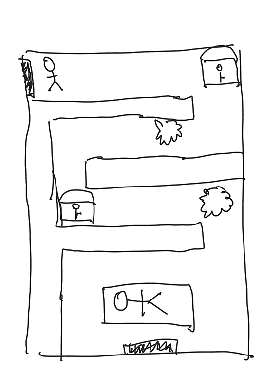
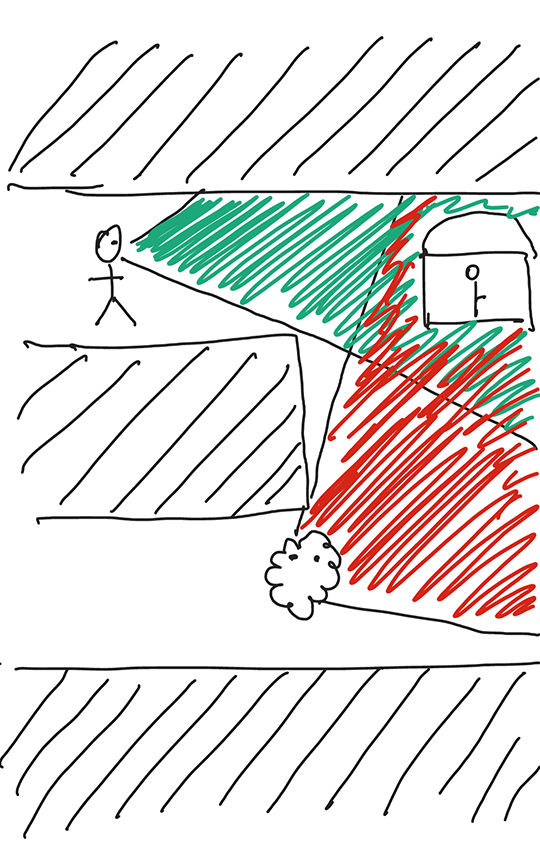
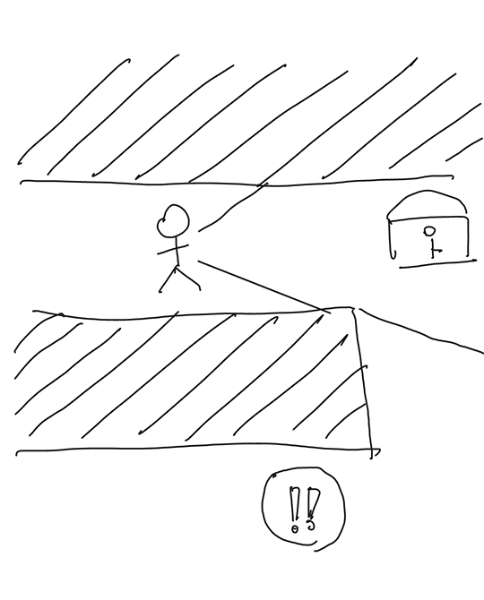

# 确定游戏的表现形式

回顾一下前面的故事内容，我们可以想像出各种不同的游戏表现形式。也许是第一人称视角，也许是跟随视角，或者是上帝模式的俯视视角。

同一个游戏主题，选择不同的表现形式，会为玩家带来完全不一样的体验。

但是选择表现形式不仅仅只考虑玩家体验问题，还需要考虑实现这种表现形式需要的技术、美术、资金和人力等资源。

考虑到本书的目标读者：一群初次接触游戏开发的菜鸟。我想上帝视角的2D俯视模式是最理性的选择。

~

## 游戏的样貌

上面一大堆废话，为我们的游戏决定了一个核心设定：游戏看上应该像什么样。

而我们就要根据这个设定，构思出游戏的基本样貌。下面是一张游戏表现形式的草图：

这张草图包含了游戏绝大部分要素：

* 角色：左上角那个看上去蠢蠢的家伙就是玩家要控制的角色。
* 场景：看起来角色正处于一个迷宫里面。
* 目标：看到最下面的睡美男了吗？那就是我们的目标。
* 奖励：迷宫里有几个箱子，里面一定装着好东西。
* 挑战：好吧，路上还有几个像毛球一样的东西，它们肯定会阻止角色达成目标。
* 结果：结果？结果当然是成功到达睡美男那里，给他一个吻（呕≥﹏≤）。

嗯，按照上面的描述，这张图看起来棒极了。我们的游戏一定会非常有趣！

但是请冷静一点，还有很多关键的内容在这张图里面没有表现出来：

* 角色怎么行动？
* 玩家是否一直可以看到整个迷宫，以及其中的宝箱、怪物？
* 角色怎么发现怪物？
* 怪物怎么发现角色？
* 怪物发现角色后会有什么反应？
* 怪物怎么阻止角色完成任务，是攻击角色吗？
* 角色怎么对抗怪物呢？
* 怪物被打倒时，会发生什么事情？
* 角色被打倒时，会发生什么事情？
* 角色怎么发现宝箱？
* 角色怎么打开宝箱？
* 打开宝箱后，会发生什么事情？
* 宝箱会给予角色什么奖励，给角色带来什么好处？
* 。。。。。

好吧，我们还有太多太多问题没有确定。所以不要急着写代码，我们继续画一些草图。画这些草图的过程，实际上就是帮助我们思考，并将思考的结果展示出来。

## 确定玩法

因为游戏最终需要靠画面来表现（除了那些纯文字游戏），所以从画面来入手构思整个游戏的细节是最有效的方式。当然，我们可以配上一些简短的说明，针对细节进行描述。

### 角色和怪物的行动

~

### 角色和怪物的可视范围

下图中，角色和怪物都具有视野的设定。视野由角色或怪物的当前朝向、视野角度决定：

因此，如果怪物位于角色的视野之外，那么角色是看不到怪物的。从游戏画面上，就是没有怪物的存在。对怪物而言，视野的效果一样。

有限的视野范围大大增加了游戏的刺激度和紧张感。玩家在游戏里会时刻小心翼翼的行动，避免被怪物觉察。

通过为玩家制造障碍来提升游戏的难度和探索性，是常用的手段。但是仅仅制造障碍还不够，我们还得为玩家提供某种解决障碍的途径：

图中，角色只能看到宝箱，而下方的怪物还处于阴影中。但屏幕上有一个包含感叹号的图标出现，提醒玩家这里会有某些需要注意的东西。

这个感叹号图标不会一直可见，而是在怪物移动时不定期的出现在怪物当前位置附近。同时，只有在角色接近到怪物一定距离后，才会看到感叹号出现。

因此，我们通过这些设定强迫玩家在行动之前仔细观察周围环境，并采取可行的行动方案。

而这样一种玩法，既符合我们古墓探险的游戏主题，又为玩家达成目标的过程增加了挑战性。当玩家通过这些挑战后，就能够体验到愉悦的成就感。

可以看出，利用草图和简短的文字描述，我们就勾勒出了游戏进行时的大致体验。而这就是确定游戏玩法的基本方法。

~

### 角色和怪物的战斗

~